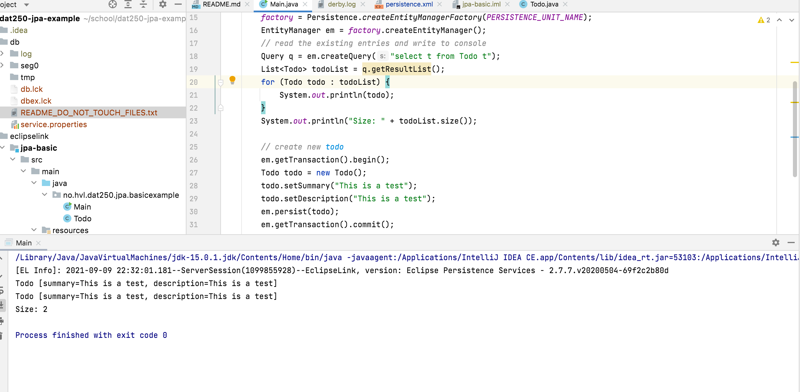
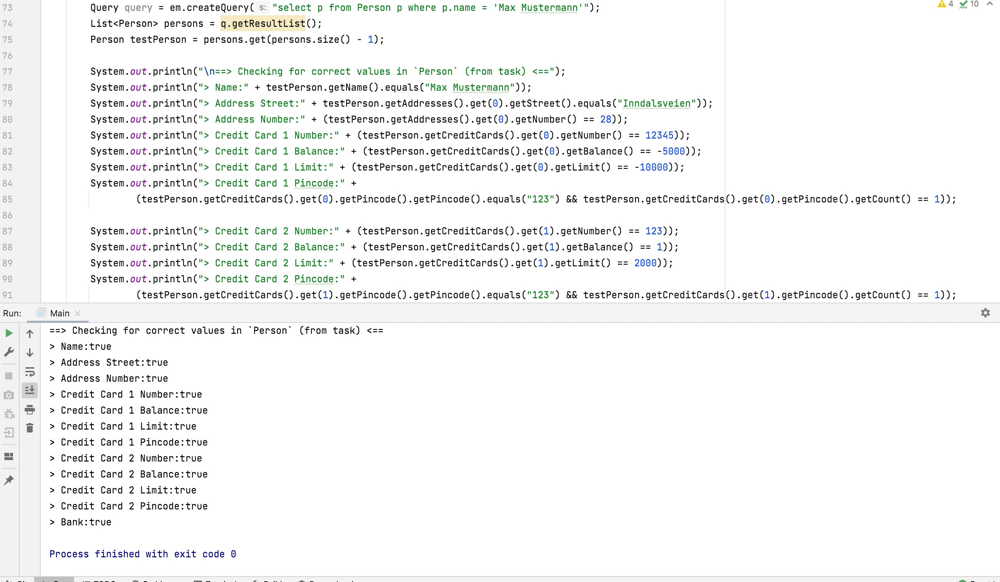

# Hand-In 1
                                                                                  
## technical problems that you encountered during installation of the software development environment and how you have 
Most of the environment was already installed on my computer, however I figured I actually needed to use the `export PATH` in my `.zprofile` in order to call the binaries from anywhere on the CLI.
                                                                                  
## How you have validated (checked) that the software development environment is working
I went through the tutorial on Heroku, and I got the expected behaviour.          
                                                                                  
## Technical problems encountered with the Heroku platform and how you solved them
I was not able to do the plugin-step because I did not verify my account, and a credit card was needed to do that.
I solved this by simply not doing it. :slightly_smiling_face: I also struggled a bit in the start with the Postgres-plugin, but resolved this when I found out I was in the wrong directory...                    
                                                                                  
## Any pending issues with this assignment which you did not manage to solve   
None as of now, except the issue with the plugin-step as explained above.                                                                    
                                                                                  
## Link to application                                                            
https://guarded-ravine-18006.herokuapp.com/

# Hand-In 2

## technical problems that you encountered during installation and use of Java Persistence Architecture (JPA) and how you resolved
First I looked into installing it manually, but soon realized that the `pom.xml`-file was already configured, and Maven took care of all the nitty gritty-details, and installed everything for me.

## a link to your code for experiments 1 and 2 above
[Experiment 1](https://github.com/larsuib/dat250-experiment-2-1)
[Experiment 2](https://github.com/larsuib/dat250-experiment-2-2)

## an explanation of how you inspected the database tables and what tables were created. For the latter, you may provide screenshots.
I inspected the tables by first printing, but then using boolean logic to confirm my "sightings", see screenshot. There was a table for each of the tables listed in the task, e.g. "Person" and "CreditCard".

## any pending issues with this assignment that you did not manage to solve
