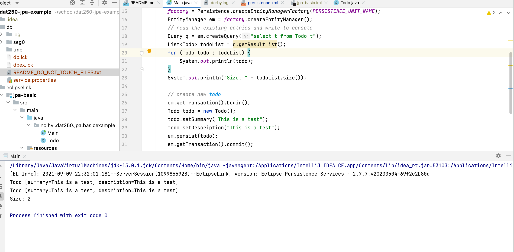

# Hand-In 2

Here is a screenshot of the generated table, by using simple `System.out.println()` to console (this is from experiment 1).

## technical problems that you encountered during installation and use of Java Persistence Architecture (JPA) and how you resolved
First I looked into installing it manually, but soon realized that the `pom.xml`-file was already configured, and Maven took care of all the nitty gritty-details, and installed everything for me. Therefore there was not too much of technical difficulties hindering me, luckily!

## a link to your code for experiments 1 and 2 above
* [Experiment 1](https://github.com/larsuib/dat250-experiment-2-1)
* [Experiment 2](https://github.com/larsuib/dat250-experiment-2-2)

## an explanation of how you inspected the database tables and what tables were created. For the latter, you may provide screenshots.
I inspected the tables by first printing, but then using boolean logic to confirm my "sightings", see screenshot below (EDIT: later I realized I did not use the `query`-var, but instead used the `q`-var higher up in the file - they are the same query). There was a table for each of the tables listed in the task, e.g. "Person" and "CreditCard".

## any pending issues with this assignment that you did not manage to solve
