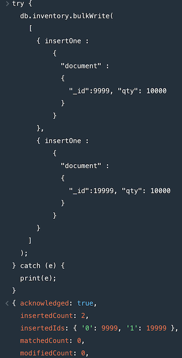

# Software Technology Experiment Assignment 3
__Author__: Lars Juvik

## Technical problems that you encountered during installation and use of MongoDB and how you resolved
I used `brew`, which was already installed on my machine, so the process went pretty smooth.

### Validation of the installation package
Used `brew` on macOS; seems like I don't need to check hashsum manually, instead `brew` does it for you.
If downloaded a package to install, I could have verified it with the tool `hashsum`.

I used following commands:
1. `brew tap mongodb/brew`
2. `brew install mongodb-community@5.0`

Following quote from [here](https://docs.brew.sh/Checksum_Deprecation):
> This means custom taps, local custom formulae, etc need to be migrated to use SHA256 __before__ you can install them.
> 
So it seems sha256 is necessary in order to actually use the `brew` packages.

Installation in terminal:

### Relevant results obtained during Experiment 1
Inserting data:

Querying in `Compass`:

Updating data:

Bulk operation:

Delete operation:

### Experiment 2 example working and the additional Map-reduce operation (and its result) developed by each of you.
`mapReduce` from examples:

`mapReduce`, custom:

## Reason about why your implemented Map-reduce operation in Experiment 2 is useful and interpret the collection obtained.
Because you can see how each product is doing, in this case: *chocolates*. This function can be useful if used in a more general way, e.g. substituting "chocolates" with the product you want to find out performance of.
The collection obtained is a list of persons, where the value is how much each person spent on chocolates.

## Any pending issues with this assignment which you did not manage to solve
Per now, there is no pending issues.

