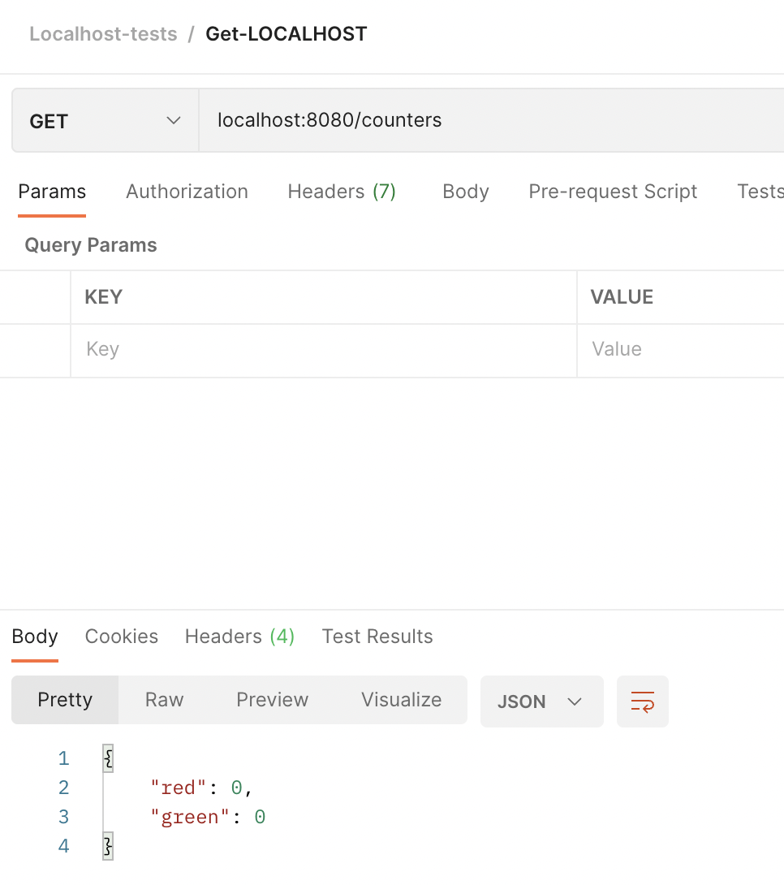
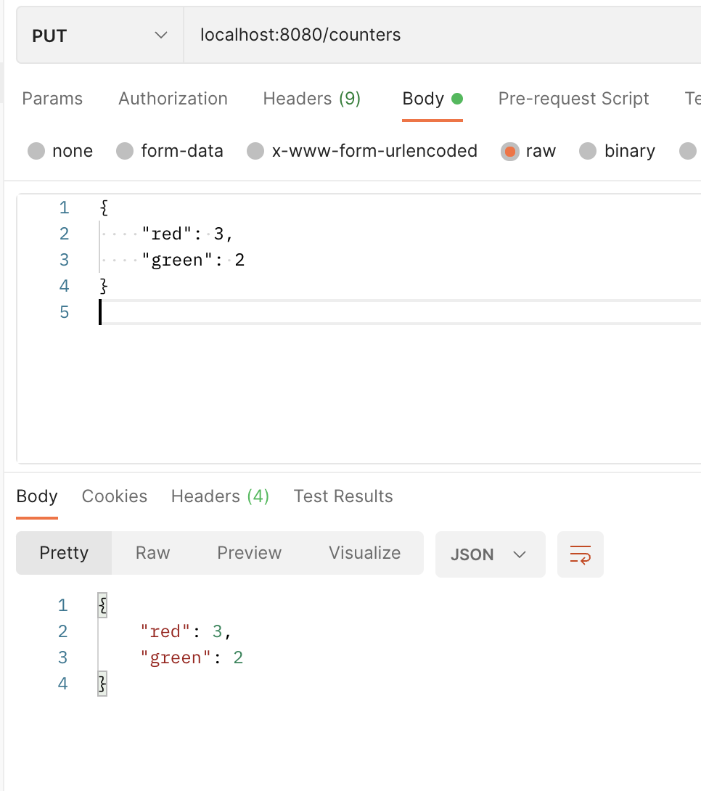

# Expass 4
I only did the compulsory tasks.

## Screenshots



## Supported requests
Basic CRUD-operations: `create`, `read`, `update` and `delete`.

API:
```java
// simplified API-calls
get("/todos");                                   
get("/todos/:id");
                                                                               
// Create                                                                      
post("/todos");         
post("/todos/:id");
                                                                               
// Update                                                                      
put("/todos/:id");
put("/todos/:id/:field")
                                                                               
// Delete                                                                      
delete("/todos/:id");
```

## Technical problems
Not that many technical problems was encountered. I needed to install the postman-desktop tool to make the requests work.

## Pending Issues
No pending issues with the mandatory tasks as far as I know. I did not do the other optional tasks (3- and 4).

## Link to repo
https://github.com/larsuib/dat250-expass4
