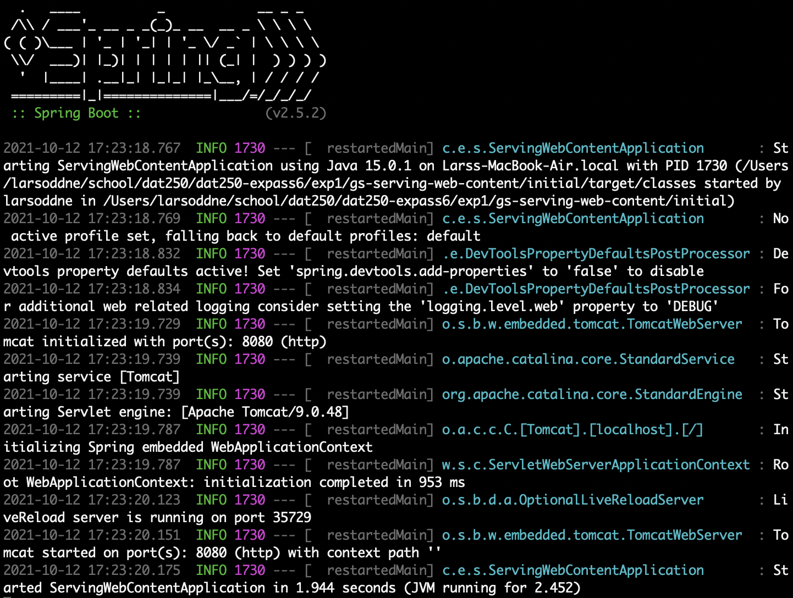
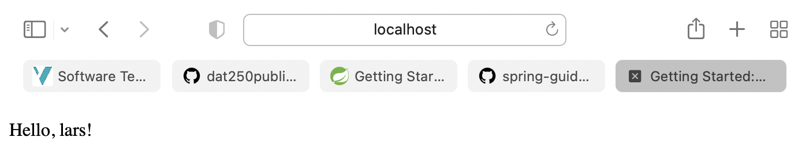
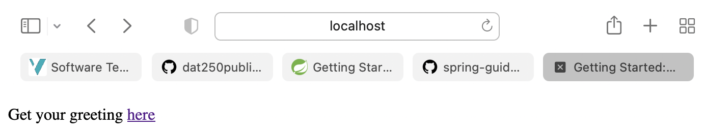
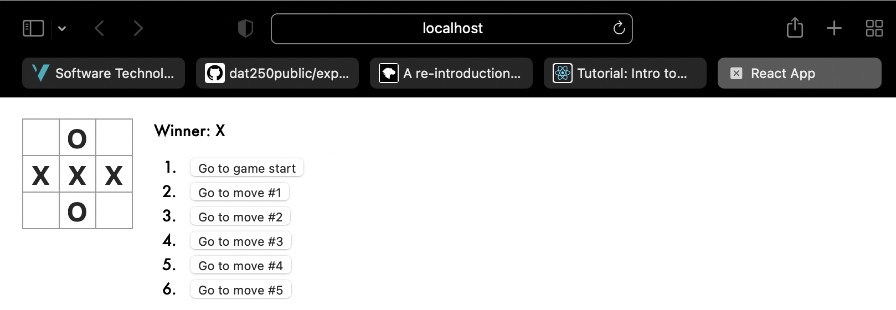

# Expass 6

I chose to do task 2 in a local development environment.

## Screenshots of some steps

   

   

   

## Technical problems
There was no technical problems.

## Link to repo
https://github.com/larsuib/dat250-expass6

## Pending issues
Theere is no pending issues. 😄
